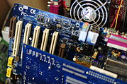
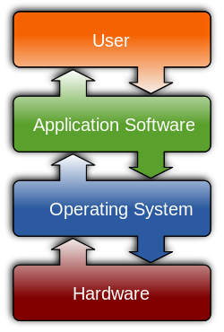

我的第一次作业
# 计算机名词解释
## Computer
A computer is a device that can be instructed to carry out sequences of arithmetic or logical operations automatically via computer programming.

(This is the inside of a computer's mainframe.)

## Computer science
Computer science is the study of the theory, experimentation, and engineering that form the basis for the design and use of computers. 

## Software
Computer software, or simply software, is a generic term that refers to a collection of data or computer instructions that tell the computer how to work, in contrast to the physical hardware from which the system is built, that actually performs the work.

> By Golftheman - This file was derived from: Operating system placement.svg:, CC BY-SA 3.0, https://commons.wikimedia.org/w/index.php?curid=49445063 

## Software engineering 
Software engineering is the application of engineering to the development of software in a systematic method.

## Alan Turing
Alan Mathison Turing OBE FRS (/ˈtjʊərɪŋ/; 23 June 1912 – 7 June 1954) was an English computer scientist, mathematician, logician, cryptanalyst, philosopher, and theoretical biologist.

## Moore's law
Moore's law is the observation that the number of transistors in a dense integrated circuit doubles about every two years. 

