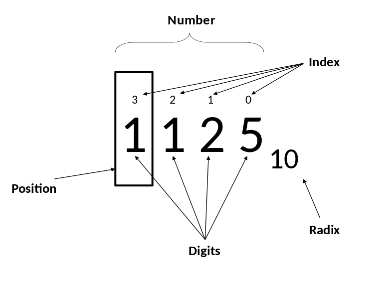
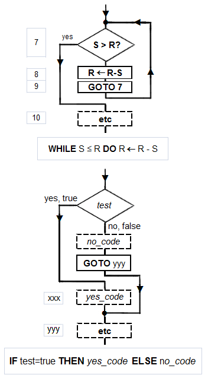

第二次作业
# Part1.
## 进制转换
1.1分12秒=72000毫秒

2.(7A)13=(122)10

3.(7A)16=(122)10

4.(7A)16=(1111010)2=(172)8

5.(1011011)2=(133)8=(91)10

6.(678)10=(1010100110)2=(1246)8

7.(111)2+(101)2=(1100)2

十进制decimal system
二进制binary system
八进制Octal system
十六进制Hexadecimal

# Part2.名词解释
## information
Information is any entity or form that provides the answer to a question of some kind or resolves uncertainty.

信息是提供某种问题的答案或解决不确定性的任何实体或形式。

## Positional notation
Positional notation or place-value notation is a method of representing or encoding numbers.

位置符号或位置值表示法是表示或编码数字的方法。

## Algorithm
In mathematics and computer science, an algorithm (/ˈælɡərɪðəm/ ( listen)) is an unambiguous specification of how to solve a class of problems. Algorithms can perform calculation, data processing and automated reasoning tasks. 

在数学和计算机科学中，一个算法是对如何解决一类问题的明确说明。算法可以执行计算、数据处理和自动推理任务。

## Software bug
A software bug is an error, flaw, failure or fault in a computer program or system that causes it to produce an incorrect or unexpected result, or to behave in unintended ways. 

软件缺陷是计算机程序或系统中的错误、缺陷、故障或故障，它导致程序或系统产生不正确或意外的结果，或以非预期的方式运行。
