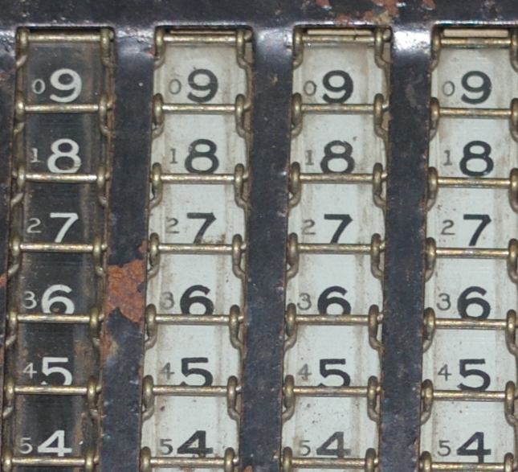

第三次课后作业PPT部分
# PART1
Write out variables x,y and z in binary code.

(1)不溢出，不溢出，不溢出

(2)溢出

(3)不溢出

(4)不溢出，不溢出，溢出

(5)无误差

(6)无误差

(7)有误差
# Part2 名词解释
## Method of complements补数法
In mathematics and computing, the method of complements is a technique used to subtract one number from another using only addition of positive numbers. 
在数学和计算中，补数法是一种只用正数的加法来从一个数减去另一个数的技术。

## Byte 字节
The byte is a unit of digital information that most commonly consists of eight bits, representing a binary number.
字节是数字信息的一个单元，通常由八位组成，表示二进制数。

## Integer (computer science) 整型
In computer science, an integer is a datum of integral data type, a data type that represents some range of mathematical integers.
在计算机科学中，整数是整数数据类型的数据，是表示某种数学整数范围的数据类型。

## Floating point 浮点数
In computing, floating-point arithmetic (FP) is arithmetic using formulaic representation of real numbers as an approximation so as to support a trade-off between range and precision.
在计算中，浮点算法（FP）是使用实数的公式表示作为近似，以支持范围和精度之间的权衡的算法。

1）这样表示非常方便，因为一个数加上它的反码就是所有位为1，然后补码等于反码加1，所以这个数加上它的补码就等于0，也就表示了这个数是它的相反数

2）（351）8

1）x = -0x1f，转换为十进制数为-31.而-31的原码表示为1000 0000 0000 0000 0000 0000 0001 1111，最高位为符号位（1为负数，0为非负数）。保持原码符号位不变，其余为取反后再加1即可得到其补码表示1111 1111 1111 1111 1111 1111 1110 0001，然后把该二进制数转换为十六进制可得到0xffffffe1。

1）NaN

NaN，是Not a Number的缩写，在IEEE浮点数算术标准（IEEE 754）中定义，表示一些特殊数值（无穷与非数值（NaN）），为许多CPU与浮点运算器所采用。