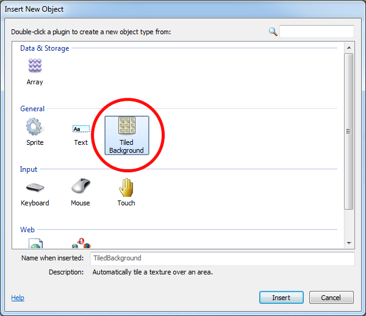
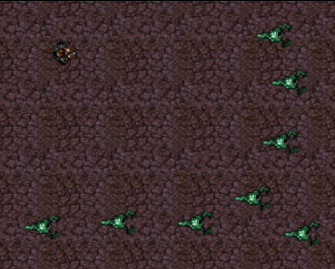

# 使用Construct 2制作游戏初次尝试
做游戏好像是件很高大上的事呢，但是有了Construct 2的协助，你也可以轻松做出属于自己的小游戏啦~
## 关于Construct 2
Construct2是一款跨平台的二维游戏开发引擎，他不需要你有任何的编码基础，通过定义部件和事件而完成游戏的制作。
  简单直观，迅速的让你拥有自己的小游戏~~  唯一的缺点就是目前还没有中文版与中文资料。~~（所以同学们还是要好好学英语的）~~

## 制作准备
### 获取Construct 2
尽管网上有各种破解版中文版，但是还是从**正版官网**下载更为安全哟。
[Construct 2官网](https://www.construct.net/en)
### 打开Construct 2
按照安装向导完成安装后，打开桌面上的Construct 2快捷方式，你会看到如下界面。

（一般来说，我们完成作业使用免费版的就可以了，希望获取更多高端功能的~~有钱~~同学可以购买。）
### 获得游戏素材
购买了Construct 2的小伙伴会获得赠送的资源包，包含游戏背景和精灵之类的元素。而免费党也不用担心哦，万能的百度上可以搜到很多素材（建议看清图片格式再下载哦，要使用png格式免抠图哦）懒得搜图又喜欢DIY的同学还可以自己画哦（这个稍后内容中会讲一下~）！

## 开始制作！
### 新建项目
点击左上角的file按钮，选择第一个选项New，然后在弹出的对话框中选择New Empty Project。

完成后你就会获得一个空白界面了。如果觉得画面太大显示不完全看的很别扭，可以点击上方View，点击放大缩小来调整视野。
如果你觉得默认布局不适合你的游戏，可以通过左侧属性栏进行编辑更改。

*特别提醒：看到画布左上角的虚线框了吗？游戏玩家只能看到虚线框内的内容，所以在调整画布时不要忘记把虚线框内游戏界面也调整一下哦！*

### 插入背景等元素
#### 背景

双击屏幕会出现一个选项框，如图进行选择（插入精灵请选择Sprite)。

这时你的光标会变成一个小十字，在界面你想放置素材的位置一点
然后弹出另一个小窗口。

（如果想自己画出精灵就点击窗口左侧画笔工具自由发挥吧！）

如图所示打开你下载好的背景图片，然后通过拖动图片来使图片达到你想要的效果，或通过左边栏来改变参数。

#### 精灵
插入精灵的操作类似就不再赘述，但是建议大家在插入前先新建一个图层（右边栏Layers，点击+号)新建图层完成后，我们可以点击小锁子锁住背景图层以防之后操作对其造成影响，然后在新建的图层中插入精灵。

#### 插入动作
以上步骤做完后你可能得到这样的画面

现在各种元素还不能动，我们需要给他们添加行为（即Behaviors).

（具体各种行为介绍请参见Construct2官方教程）[官方教程](https://www.scirra.com/tutorials/37/beginners-guide-to-construct-2/page-3)

按照你的需要给精灵添加完动作后，调整一下角度（运动方向由小正方形指向决定）和速度他们就可以在界面内移动了。
### 创建事件
现在你的各种元素之间还没有产生联系，点击界面上方彩色边栏Event sheet1就可以在元素之间添加你需要的事件了，

关于各种事件的介绍请参见官网指南[官网指南](https://www.scirra.com/tutorials/37/beginners-guide-to-construct-2/page-4)

这样你就可以设置点击鼠标发射子弹等动作了。

### 计分机制
一款完整游戏怎么能没有计分功能呢。
右击空白处，在弹出的选项框中选择如下选项

将名字改为Score，然后再次打开事件栏在设置射击目标死亡那一栏下，为system添加动作。

将初始值设置为零。

## 运行试试吧！
游戏做完之后就来运行看看吧！
界面差不多这样

点击上方run out按钮你就可以玩自己做的游戏啦！

