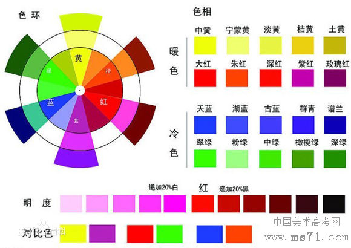
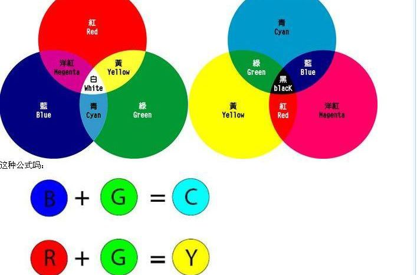
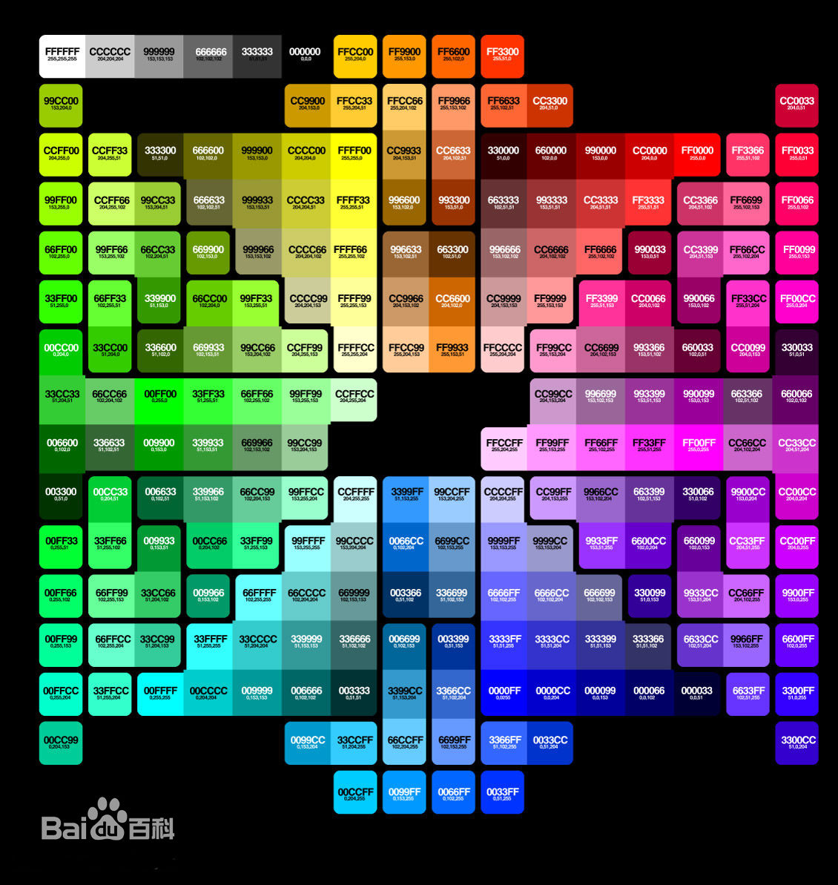

# 色彩表示与编码

## 色彩
色彩是能引起我们共同的审 美愉悦的、最为敏感的形式要素。色彩是最有表现力的要素之一，因为它的性质直接影响人们的感情。丰富多样的颜色可以分成两个大类无彩色系和有彩色系，有彩色系的颜色具有三个基本特性：色相、纯度（也称彩度、饱和度）、明度。在色彩学上也称为色彩的三大要素或色彩的三属性。饱和度为0的颜色为无彩色系。

## 三原色

人眼对红、绿、蓝最为敏感，人的眼睛像一个三色接收器的体系，大多数的颜色可以通过红、绿、蓝三色按照不同的比例合成产生。同样，绝大多数单色光也可以分解成红、绿、蓝三种色光，这是色度学的最基本的原理，也称三原色原理。

## RGB

RGB色彩模式是工业界的一种颜色标准，是通过对红(R)、绿(G)、蓝(B)三个颜色通道的变化以及它们相互之间的叠加来得到各式各样的颜色的，RGB即是代表红、绿、蓝三个通道的颜色，这个标准几乎包括了人类视力所能感知的所有颜色，是目前运用最广的颜色系统之一。

## CMYK

印刷四色模式是彩色印刷时采用的一种套色模式，利用色料的三原色混色原理，加上黑色油墨，共计四种颜色混合叠加，形成所谓“全彩印刷”。四种标准颜色是：
C：Cyan = 青色，又称为‘天蓝色’或是‘湛蓝’M：Magenta = 品红色，又称为‘洋红色’；Y：Yellow = 黄色；K：key=关键，这里的K指代key，是打印设备校准用的。另外，K:还可以代表Black，黑色，因为印刷用黑色用的比较多。

